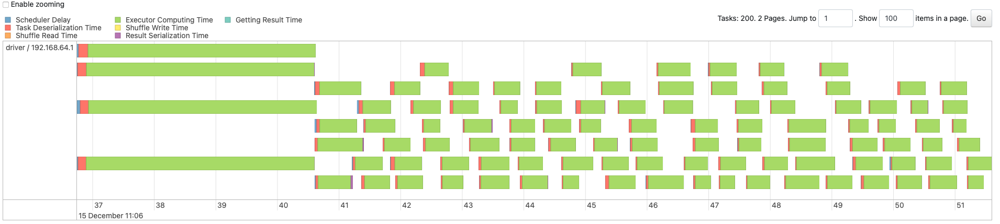

# Goodnotes

# Tasks

## Pre assignment
Dependencies:
- brew (recent enough for python 3.12)
- pyenv
- pyenv-virtualenv

```bash
pyenv virtualenv 3.12 goodnotes
pyenv activate goodnotes
pip install uv # uv only for package management
uv pip install -r requirements.txt
mkdir scripts
touch scripts/generate.py
mkdir data
```

Copy the code from github to the script then run script:
```bash
python3 scripts/generate.py
mv user_interactions_sample.csv data/user_interactions_sample.csv
mv user_metadata_sample.csv data/user_metadata_sample.csv
```

Execute a script (example)
```bash
PYTHONPATH=./ python3 spark_jobs/active_users.py
```

### 1. Calculate daily active users (DAU) and monthly active users (MAU) for the past year.
- An active user will be a user who did at least one interaction given the day / month, with following properties:
    - They have been logged for more than 10seconds
    - They have been logged for less than 4h
- Some problems for those kind of metrics
    - activity duration crossing 2 days - we currently only compute from start timestamp but we could consider computing an end timestamp and adding on activity count
    - multiple region users - is a day in utc or relative to the user timezone
    - the quality of the interaction - reporting tends to be biased for activity if too broadly defined
- If the data is split by date then those simple queries should already be able to only load on memory a month at a time, some improvements for performance:
    - make sure the data is not skewed (depending on file size distribution), might need to evenly salt the data after load
    - change countDistinct for approx_count_distinct, but I do not recommend using it for this kind of metrics which core to any business
    - file format csv to parquet can be a very huge noticeable performance improvement
    - maintain pre computed / incremental daily unique users for monthly agregation

MAU table
```
+-------------------+------------------+                                        
|month              |count_active_users|
+-------------------+------------------+
|2023-05-01 00:00:00|79162             |
|2023-08-01 00:00:00|79118             |
|2023-04-01 00:00:00|76085             |
|2023-12-01 00:00:00|76806             |
|2023-07-01 00:00:00|78921             |
|2023-06-01 00:00:00|76787             |
|2023-03-01 00:00:00|79175             |
|2023-09-01 00:00:00|76373             |
|2023-01-01 00:00:00|78698             |
|2023-11-01 00:00:00|76530             |
|2023-02-01 00:00:00|71789             |
|2023-10-01 00:00:00|79255             |
+-------------------+------------------+
```

For storage even thoug not mentionned, I recommand an efficielt column-base filed system like parquet, either regular s3 or iceberg, or a delta lake. Why not s3 table buckets also ? (if it ever comes to HK ...)

### 2. Implement a session-based analysis to understand user behavior patterns
- Session definition:
    - A session starts with a user's first action and end when no more actions for 10minutes
    - A session actions will be grouped inside the same section when they respect above condition
    - A session is the action duration of no subsequent actions in time frame
- Session duration:
    - Between first action and last action timestamps
- Actions per session:
    - Grouping of actions for each session, counted
- Session frequency:
    - How many sessions per period etc

Session statistics (top 20)
```
+-------+--------------+--------------------+                                   
|user_id|total_sessions|avg_session_duration|
+-------+--------------+--------------------+
|u000002|             1|              88.297|
|u000015|             1|             229.486|
|u000022|             2|            124.1645|
|u000031|             2|             84.7965|
|u000049|             1|              31.507|
|u000051|             1|              91.526|
|u000053|             2|            201.5695|
|u000058|             1|              77.495|
|u000061|             1|              84.956|
|u000065|             1|             182.436|
|u000068|             1|             268.994|
|u000086|             3|              78.724|
|u000087|             1|                2.88|
|u000098|             1|                85.4|
|u000112|             1|             249.678|
|u000134|             1|             223.495|
|u000136|             1|             239.259|
|u000142|             3|  126.36366666666667|
|u000147|             3|  116.12833333333333|
|u000149|             2|             101.985|
+-------+--------------+--------------------+
```

### 3. Spark UI Analysis
#### a. Analyze the Spark UI for the above data pipeline job and identify any findings or bottlenecks

Possible bottlenecks we want to prevent / optimize in a spark job:
- Shuffling for sorting and partitioning.
- High memory usage due to large partitions or intermediate data.
- Skewed data causing uneven task durations.

The main stages of our application are:
- Loading the csv metadata
- Shuffling the data to executors partition by user_id
- Window per user_id, then per (user_id, session_id) and agregate per user_id for final user statistics and write a parquet file

#####  Stage 0: Loading the csv metadata


This part is loading the csv metadata (headers), nothing to optimize here.

###### Stage 1: Loading csv data and repartitionning

This stage is loading the csv file and is shuffling the data accross executors.
From the Physical plan we can observe that:
```
Exchange hashpartitioning(user_id#17, 200), ENSURE_REQUIREMENTS, [plan_id=201]
```
The optimizer is using user_id and distributing it in partitions because the following window operation uses user_id.


We can see the data is using 4 partitions to load the data with approximately 250k per partitions.
This is because spark.sql.files.minPartitionNum is defaulted to spark.default.parallelism (max(2, number_cores)). The local mode assigned one driver executor with 4 cores, thus 4 partitions were assigned to read the data.

Stage 2: Transformations

The last stage correspond to the transformations applied to the dataframe. 

First window:


The first subpart correspond to the first window operation applied to lag the events by timestamp. 


This window operation is based on an ordered timestamp, it triggers a sorting. Because the data is already partitionned by user_id, the partitions end up both sorted and by user id after this operation.
It is then followed by the Project operation, because we create new columns: time_diff_min, is_new_session.

Second window:


We now create the session_id. This column requires a window operation.


The window operation is based on an ordered timestamp, it triggers a sorting

There is now the group by (user_id, session_id), this triggers 2 SortAggregate operations:
- The groupByKey per partition
- The reduceByKey


This is the last step which is the group by user id to compute some average and count statistics on the sessions, this triggers 2 HashAggregate operations:
- The groupByKey per partition
- The reduceByKey
This is the last step before writing the files as parquet.




Looking at the event timeline and summary metrics,  we can see that the default 200 partitions were sharing the chunks and the workload, thus creating 200 parquet files. The distribution seems to be even enough among all the partitions. We do not observe absurd data skewing.


#### b / c. Explain or implement improvements based on your Spark UI analysis + optimization

- We can see the data in each partitions is around 140Kb, while it is good to have more partitions, it is not good to have too small partitions as it increases overhead and shuffling -> reduce number of partition
- The first groupBy is using SortAggregate instead of HashAggregate. This operation is because spark is not able to fit the hash table in memory. The reason is because of the data cardinality is very high, it has almost as many unique key_id as records. With a more realistic dataset we should be able to optimize this to use a much faster hash aggregate.

Knowing above bottle necks, let's configure some optimization
```
spark.sql.files.maxPartitionBytes = 5mb
```

For the stage 2, we want to tune the number of partitions. We can target a multiple of 1 to 4 partitions per core. The fastest solution found was with 4 partitions:
```
repartition(4, F.col("user_id"))
```
This will results in 4 files for ~600k records, this is acceptable

Pre optimization:


Post optimization:


Total time went from 42s to 14s.

### 4. Data Processing and Optimization
#### a. Implement a Spark job to join the User Interactions and User Metadata datasets efficiently, handling data skew
For data skew, we will opt for a salting strategy on the join key. This is a simple case here because there is only one join key.
- Broadcast join
    - The smallest table is still 100gb of data, even though it is smaller than the biggest one, this definitely doesn't strike as a good solution.
- Shuffle Hash join
    - We are already salting, so we are now controlling the "hash" and the even distribution accross partitions. If we apply a shuffle has join we might creates other un evenness in the distribution of the data.
- Sorted merge join
    - Sorting ensures that all keys, including salted ones, are grouped together within partitions, minimizing variability during processing. Also the sorting makes the newly created salted key to be distributed evenly accross executors, greatly avoiding the risk of data skew and OOM.
We will opt for a salting strategy to address data skew + sorted merge join for efficiently distributing salted keys accross partitions and avoiding OOM.

###  5. Design and implement optimizations for the Spark job to handle large-scale data processing efficiently
pre optimizaiton file: pre_optimization_users_with_metadata.py
post optimizaiton file: post_optimization_users_with_metadata.py

##### i. Analyze and optimize operations - Give two files: Pre optimization and post optimization

Pre optimization script:
```
== Physical Plan ==
AdaptiveSparkPlan isFinalPlan=false
+- Project [user_id#17, timestamp#18, action_type#19, page_id#20, duration_ms#21, app_version#22, join_date#47, country#48, device_type#49, subscription_type#50]
   +- BroadcastHashJoin [user_id#17], [user_id#46], Inner, BuildRight, false
      :- Filter isnotnull(user_id#17)
      :  +- FileScan csv [user_id#17,timestamp#18,action_type#19,page_id#20,duration_ms#21,app_version#22] Batched: false, DataFilters: [isnotnull(user_id#17)], Format: CSV, Location: InMemoryFileIndex(1 paths)[file:/Users/come.vitis/Documents/Projects/Goodnotes/data/user_interact..., PartitionFilters: [], PushedFilters: [IsNotNull(user_id)], ReadSchema: struct<user_id:string,timestamp:string,action_type:string,page_id:string,duration_ms:string,app_v...
      +- BroadcastExchange HashedRelationBroadcastMode(List(input[0, string, false]),false), [plan_id=64]
         +- Filter isnotnull(user_id#46)
            +- FileScan csv [user_id#46,join_date#47,country#48,device_type#49,subscription_type#50] Batched: false, DataFilters: [isnotnull(user_id#46)], Format: CSV, Location: InMemoryFileIndex(1 paths)[file:/Users/come.vitis/Documents/Projects/Goodnotes/data/user_metadata..., PartitionFilters: [], PushedFilters: [IsNotNull(user_id)], ReadSchema: struct<user_id:string,join_date:string,country:string,device_type:string,subscription_type:string>
```

This plan shows the usage of a broadcasthashjoin by using a broadcast mode of hashed (but not shuffled) keys from the metadata files. Here are the key issues:
- Broadcast exchanged of hashed keys from metadata table on a 100gb of data will require holding in executor memory the table. This will not be feasable without allocating at least 100gb of data for each executors. It will also require a big amount of partitions (100gb / 128MB ~ 800) and thus a lot of cpu.

However, this is using a relatively small dataset, here is the most possible outcome:
```
== Physical Plan ==
AdaptiveSparkPlan isFinalPlan=false
+- Project [user_id#17, timestamp#18, action_type#19, page_id#20, duration_ms#21, app_version#22, join_date#47, country#48, device_type#49, subscription_type#50]
   +- ShuffledHashJoin [user_id#17], [user_id#46], Inner, BuildRight
      :- Exchange hashpartitioning(user_id#17, 200), ENSURE_REQUIREMENTS, [plan_id=65]
      :  +- Filter isnotnull(user_id#17)
      :     +- FileScan csv [user_id#17,timestamp#18,action_type#19,page_id#20,duration_ms#21,app_version#22] Batched: false, DataFilters: [isnotnull(user_id#17)], Format: CSV, Location: InMemoryFileIndex(1 paths)[file:/Users/come.vitis/Documents/Projects/Goodnotes/data/user_interact..., PartitionFilters: [], PushedFilters: [IsNotNull(user_id)], ReadSchema: struct<user_id:string,timestamp:string,action_type:string,page_id:string,duration_ms:string,app_v...
      +- Exchange hashpartitioning(user_id#46, 200), ENSURE_REQUIREMENTS, [plan_id=66]
         +- Filter isnotnull(user_id#46)
            +- FileScan csv [user_id#46,join_date#47,country#48,device_type#49,subscription_type#50] Batched: false, DataFilters: [isnotnull(user_id#46)], Format: CSV, Location: InMemoryFileIndex(1 paths)[file:/Users/come.vitis/Documents/Projects/Goodnotes/data/user_metadata..., PartitionFilters: [], PushedFilters: [IsNotNull(user_id)], ReadSchema: struct<user_id:string,join_date:string,country:string,device_type:string,subscription_type:string>
```

In this scenario, we tried to replicate a huge dataset by hinting a hash merge: hint("shuffle_hash"). Here are the problems
- Shuffling cost is very high and will taking a huge shunk of the computation time considering the amount of data.
- The partition size will not be evenly distributed because of the skewed data, it will lead to long computation time and executors OOM.

Post optimization
```
== Physical Plan ==
AdaptiveSparkPlan isFinalPlan=false
+- Project [user_id#17, timestamp#18, action_type#19, page_id#20, duration_ms#21, app_version#22, join_date#56, country#57, device_type#58, subscription_type#59]
   +- SortMergeJoin [user_id#17, salt#29L], [user_id#55, cast(salt#66 as bigint)], Inner
      :- Sort [user_id#17 ASC NULLS FIRST, salt#29L ASC NULLS FIRST], false, 0
      :  +- Exchange hashpartitioning(user_id#17, salt#29L, 200), ENSURE_REQUIREMENTS, [plan_id=72]
      :     +- Filter (isnotnull(user_id#17) AND isnotnull(salt#29L))
      :        +- Project [user_id#17, timestamp#18, action_type#19, page_id#20, duration_ms#21, app_version#22, FLOOR((rand(5068384140133388679) * 8.0)) AS salt#29L]
      :           +- FileScan csv [user_id#17,timestamp#18,action_type#19,page_id#20,duration_ms#21,app_version#22] Batched: false, DataFilters: [], Format: CSV, Location: InMemoryFileIndex(1 paths)[file:/Users/come.vitis/Documents/Projects/Goodnotes/data/user_interact..., PartitionFilters: [], PushedFilters: [], ReadSchema: struct<user_id:string,timestamp:string,action_type:string,page_id:string,duration_ms:string,app_v...
      +- Sort [user_id#55 ASC NULLS FIRST, cast(salt#66 as bigint) ASC NULLS FIRST], false, 0
         +- Exchange hashpartitioning(user_id#55, cast(salt#66 as bigint), 200), ENSURE_REQUIREMENTS, [plan_id=73]
            +- Generate explode([0,1,2,3,4,5,6,7]), [user_id#55, join_date#56, country#57, device_type#58, subscription_type#59], false, [salt#66]
               +- Filter isnotnull(user_id#55)
                  +- FileScan csv [user_id#55,join_date#56,country#57,device_type#58,subscription_type#59] Batched: false, DataFilters: [isnotnull(user_id#55)], Format: CSV, Location: InMemoryFileIndex(1 paths)[file:/Users/come.vitis/Documents/Projects/Goodnotes/data/user_metadata..., PartitionFilters: [], PushedFilters: [IsNotNull(user_id)], ReadSchema: struct<user_id:string,join_date:string,country:string,device_type:string,subscription_type:string>
```
The improvements:
- The salting of the Metadata table & the Interactions table will take care of the skew key issue, avoiding OOM.
- The sorting of the hash key will distribute to the correct chunk of dataset in executors, without the need for shuffle.

##### ii. Memory management and configuration

Some rule of thumbs I will use for computing memory allocation:
- ~ 128MB of data per partitions
- ~ 3 partitions per core
- ~ 4 core per executors
- Driver allocated memory is very depending on the number of file we want to write or data we want to collect etc.
- default memory fraction: 0.6
- default jvm reserved memory: 300mb
- default spark memory fraction: 0.5 (especially with sorting / shuffling operations)

For 100gb of data:
- Executors
    - 100gb / 128mb ~ 800 partitions
    - 800 partitions / 4 partitions per cores = 200 cores
    - 200 cores / 4 cores per executors = 50 executors
    - add 300mb of memory
    - divide by 0.3 (0.6 * 0.5 for overhead and execution)
    - 128 mb * 4 partitions * 4 cores / 0.3 + 300mb ~= 8gb
- Drivers
    - There are 800 partitions, which will still add some load to the driver, we can allocate between 4 and 8times the executor memory
Final:
- Executors: 50 executors of 8gb of memory totalling 400gb of memory
- Driver: 8gb of memory

For 500gb of data:
- Executors: 250 executors of 8gb of memory 2tb of memory
- Driver: 12gb of memory (executors memory is still 1gb but more partitions)

For 1tb of data:
- Executors: 500 executors of 8gb of memory totalling 4tb of memory
- Driver: 16gb of memory (same)

##### iii. Parallelism and resource utilization

- Optimal parallelism can be set to 128mb of memory per partitions, 4 partitions per core and 4 cores per executors, setting it to around 8gb of memory on executors
- Parameters helping for dynamic partition tuning
    - spark.sql.files.maxPartitionBytes: tune to load files in chunk, default is partition size 128mb
    - spark.sql.adaptive.advisoryPartitionSizeInBytes: advisory partition size in bytes after a shuffle operations, should be set to 128mb to fully leverage parallelism
    - spark.sql.adaptive.coalescePartitions.minPartitionSize: when using adaptive query execution, this is used to always ensure a certain number of partitions after a shuffling + coalesce operations by the AQE
- Recommended configurations:
    - The query is supposedly using 1TB of user interactions + 100Gb of metadata. Aditionally we exploded the metadata table 10x so we have ~2TB of data
        - 100 executors
        - 4 Cores per executors
        - 8Gb for executors / 12Gb for driver
        - Shuffle partitions should be 1600 partitions


# Architecture


This diagram explain the architecture components of running pyspark in cluster standalone mode.

Components:
- Airflow, for the scheduler, leveraging iterative computes as much as possible, monitoring jobs and handling data flows.
- Spark Operator: EMR is also a possibility here. Spark operator is a useful interface for managing spark standalone cluster on K8S.
- ECR / S3: Amazon as an example for image and data storing.